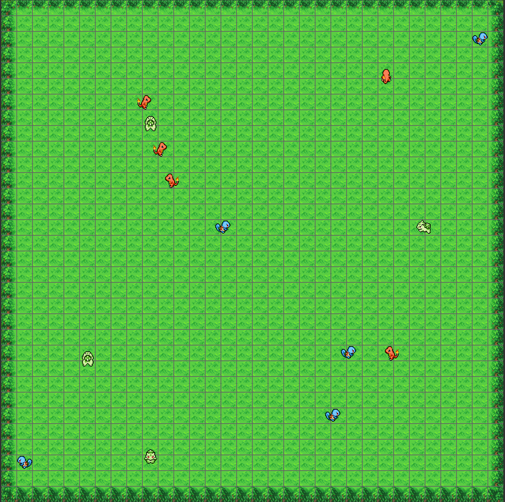

# ZZ1Game



## Build

```
make               # build the simulation (main) and the AI trainer (trainer)
make main          # build the simulation (main)
make trainer       # build the AI trainer (trainer)
make nx            # build the simulation (zz1game.nro) targetting the Nintendo Switch platform, require DKP / DevKitPro environment (build succeed on Windows DKP at least, may not on Linux DKP)
      
make run           # run main
make test          # run main with valgrind configured
make test_trainer  # run trainer with valgrind configured

make doc           # build the html doxygen documentation
make clean         # clean up the env
make reclean       # clean up the env & delete executables 
```

## Usage

- Step 1 : Use the trainer to create and train AIs
- Step 2 : Use the manager.py to extract best AIs as xx.best.xx files
- Step 3 : Start the simulation and select your settings


### Notes about the Switch version
- The AIs must be trained and named as xx.best.xx in the brains folder before the simulation's compilation as there are packed inside.
- Obviously tested on a real Switch and on Yuzu Emulator
- The build require DevKitPro environment for Windows / Linux (due to unknown reason, the compilation failed on SDL linking on Linux, during test)
